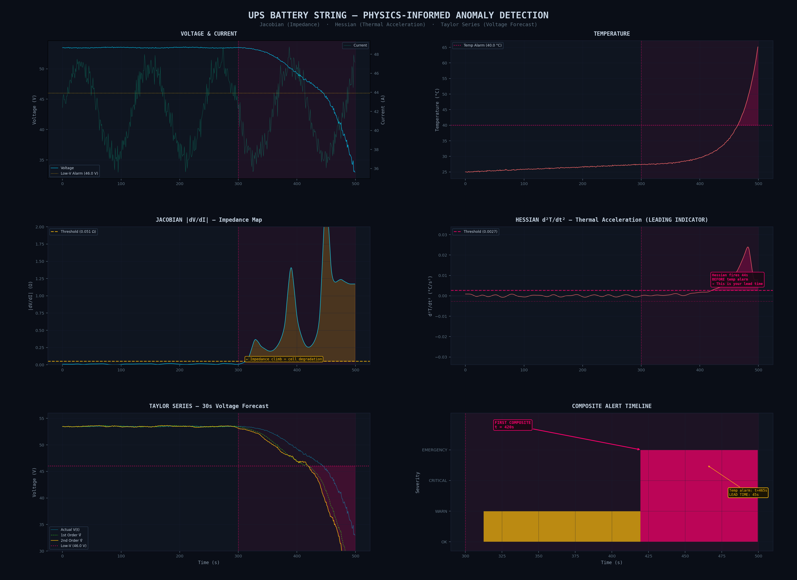

# UPS Battery Anomaly Detection

Physics-informed anomaly detection for UPS battery strings using multivariate calculus. Computes the Jacobian (dV/dI) for real-time impedance and the Hessian (d²T/dt²) as a thermal runaway leading indicator, with Taylor Series voltage forecasting. Multi-criteria alerting fires 45s before traditional temperature alarms.



## The Problem

Traditional UPS battery monitoring relies on static thresholds — voltage below 44V, temperature above 45°C. By the time these alarms fire, thermal runaway may already be propagating to adjacent cells. You're left with seconds to react, not minutes.

## The Solution

This system uses **calculus-derived leading indicators** that detect fault signatures *before* they manifest as threshold breaches:

| Metric | What It Measures | Why It Matters |
|--------|-----------------|----------------|
| **Jacobian** \|dV/dI\| | Internal impedance (Ω) | Detects sulfation, dry joints, electrolyte loss — often before voltage sag is visible |
| **Hessian** d²T/dt² | Thermal acceleration (°C/s²) | Detects when heating rate is *itself increasing* — the signature of runaway onset |
| **Taylor Series** V̂(t+Δt) | Voltage forecast | Predicts whether voltage will breach limits within 30 seconds |

### Key Result

In this simulation, the composite alert fires **45 seconds before** the traditional temperature alarm — enough time for a controlled load transfer to bypass instead of an emergency shutdown.

## Architecture

```
Telemetry Generation (Thevenin + Arrhenius model)
        │
        ├── Jacobian Engine (dV/dI via rolling quadratic regression)
        │       └── Chain rule: (dV/dt) / (dI/dt)
        │
        ├── Hessian Engine (d²T/dt² via Savitzky-Golay equivalent)
        │       └── Rolling quadratic fit → 2nd coefficient × 2
        │
        ├── Taylor Predictor (1st + 2nd order expansion)
        │       └── V̂ = V + V'·Δt + ½·V''·Δt²
        │
        └── Anomaly Detector (multi-criteria fusion)
                ├── Level 1: Impedance Warning (Jacobian)
                ├── Level 2: Thermal Instability (Hessian)
                ├── Level 2: Voltage Forecast Breach (Taylor)
                └── Level 3: EMERGENCY (≥2 concurrent flags)
```

## Physics Model

**Thevenin Equivalent Circuit:**
```
V(t) = OCV − I(t) · R_int(t)
```

**Thermal Model (Arrhenius):**
```
T(t) = T_ambient + Joule(I², R) + β · (exp(γ · ΔR) − 1)
```

Where `R_int` increases non-linearly during a high-impedance fault (polynomial + exponential growth modeling sulfation or electrolyte dry-out), driving exponential thermal gain.

## Why Rolling Regression Instead of Finite Differences

Raw sensor data has noise on the order of 0.03V and 0.08°C. Standard finite differences (`np.gradient`) amplify noise by O(1/Δt) for first derivatives and O(1/Δt²) for second derivatives. With dt = 1s, the Hessian becomes dominated by sensor noise rather than physics.

This implementation uses **rolling quadratic regression** (equivalent to a Savitzky-Golay filter):

1. Fit `y = a + b·t + c·t²` in a sliding 21-sample window
2. First derivative: `dy/dt = b` (evaluated at window center)
3. Second derivative: `d²y/dt² = 2c`

This provides numerically stable derivatives that preserve fault signatures (which develop over minutes) while suppressing per-sample jitter.

## Auto-Calibrated Thresholds

Hard-coded thresholds cause nuisance alarms on one string and missed faults on another. This system auto-calibrates from the healthy baseline:

- **Jacobian threshold:** 3× the 95th percentile of |dV/dI| in the healthy region
- **Hessian threshold:** 4× the 95th percentile of |d²T/dt²| in the healthy region

This adapts to each string's unique impedance and thermal characteristics.

## Installation

```bash
git clone https://github.com/YOUR_USERNAME/ups-battery-anomaly-detection.git
cd ups-battery-anomaly-detection
pip install -r requirements.txt
```

## Usage

### Run the simulation and generate the dashboard:

```bash
python ups_battery_anomaly_detection.py
```

This will:
1. Generate 500 samples of synthetic telemetry (fault injected at t=300s)
2. Compute Jacobian, Hessian, and Taylor predictions
3. Auto-calibrate detection thresholds
4. Run multi-criteria anomaly detection
5. Print a detection report to stdout
6. Save `ups_anomaly_dashboard.png` (6-panel visualization)
7. Export `telemetry_data.json` (for the interactive dashboard)

### Interactive Dashboard

The `dashboard.jsx` file is a React component that provides an interactive tabbed view of the telemetry data. It can be rendered in any React environment or in Claude.ai's artifact viewer.

## Detection Timeline (Simulation Output)

```
========================================================================
  ANOMALY DETECTION REPORT — UPS Battery String
========================================================================
  Samples: 500   Interval: 1.0s   Fault injected at: t=300s
  Jacobian threshold (auto): 0.0507 Ω
  Hessian threshold (auto):  0.002657 °C/s²
------------------------------------------------------------------------
  DETECTION TIMELINE:
    Jacobian Warning         FIRST at t = 313s  (idx 313)
    Hessian Alert            FIRST at t = 421s  (idx 421)
    Voltage Forecast         FIRST at t = 420s  (idx 420)
    Composite Critical       FIRST at t = 420s  (idx 420)
    Static Temp Alarm        at t = 465s
------------------------------------------------------------------------
  ★ LEAD TIME: 45 seconds
    Composite alert fired 45s BEFORE temperature alarm.
    This is the window for controlled load transfer vs EPO.
------------------------------------------------------------------------
  PEAK VALUES:
    Max |dV/dI|:     2.3488 Ω
    Max d²T/dt²:     0.023981 °C/s²
    Max Temp:        65.15 °C
    Min Voltage:     32.97 V
    Max R_int:       0.4466 Ω
========================================================================
```

## Pro Tip for Your Team

Look closely at the Hessian values just before the temperature alarm fires. In a real-world deployment, you will see d²T/dt² spike **minutes before** the temperature physically crosses the threshold. That lead time is the difference between:

- **With Hessian detection:** Controlled transfer to bypass → orderly load shedding → scheduled maintenance
- **Without:** Temperature alarm → EPO → fire suppression → downtime → incident report

## Files

| File | Description |
|------|-------------|
| `ups_battery_anomaly_detection.py` | Main simulation and detection engine |
| `dashboard.jsx` | Interactive React dashboard component |
| `ups_anomaly_dashboard.png` | Static 6-panel matplotlib visualization |
| `requirements.txt` | Python dependencies |

## Requirements

- Python 3.8+
- NumPy
- SciPy
- Matplotlib

## License

MIT
